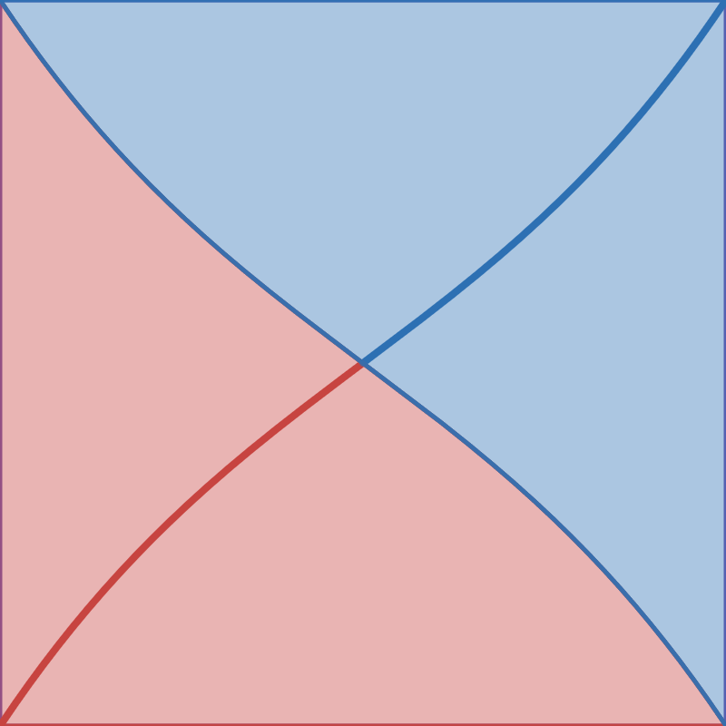

[

][1]

# Scoresaber Graphs

ScoreSaber is cool but it only gives you one performance graph. What if you could get more?

## FAQ

### Will seeing these graphs increase my skill?

No.

### Is seeing my performance graphs fun?

Absolutely yes!

### How to best use these graphs?

Try to increase your median pp scores, by practicing on songs which have a star rating close to your median/higher than median star rating. You can choose trending songs by star ratings on Scoresaber.

## TODO

- [x] raw/weighted pp over time
- [ ] raw/weighted pp histogram
- [ ] star rating cross-matrix against pp
- [ ] nice frontend to display interactive charts

### Cancelled

- History of scores against songs played: would it be nice to view my full progression and plot some interesting highlight points on those rating jumps
  - ScoreSaber doesn't return the full history (possibly doesn't even store it) for a player (only last two months)
  - We cannot get the frozen leaderboard as it was on a particular timestamp (to be able to reconstruct history)

[1]: https://www.desmos.com/calculator/hhmszweref